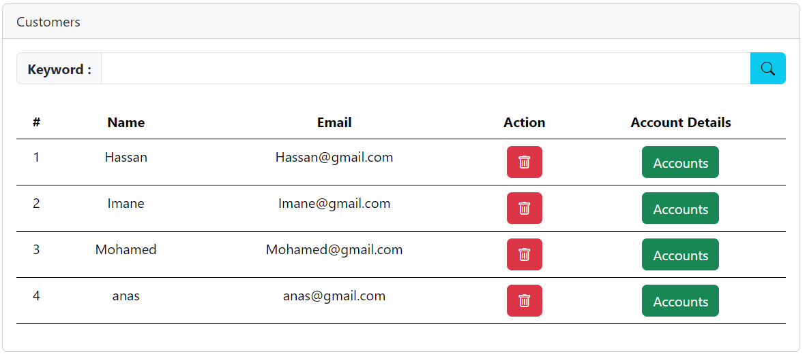

# Digital Banking Application en utilisant Angular Framework pour le frontend et Spring Boot pour le backend

## Introduction

Ce projet est une application de banque numérique qui permet aux utilisateurs de consulter leurs comptes, de transférer de l'argent, de payer des factures et de consulter l'historique des transactions. Il est développé en utilisant Angular Framework pour le frontend et Spring Boot pour le backend.

## Fonctionnalités

- Authentification (en tant que client ou admin)
- Consulter les comptes
- Consulter les transactions
- Faire une opération (débit, crédit ou transfert)
- Consulter l'historique des transactions
- Consulter les utilisateurs
- Recherche par nom de client
- Ajouter un utilisateur
- Supprimer un utilisateur

## Technologies utilisées

- Angular Framework
- Spring Boot
- Bootstrap
- Bootstrap Icons
- JWT (JSON Web Token)

## Installation

1. Cloner le projet :

```bash
git clone https://github.com/anaserrami/e-Banking-App.git
```

2. Accéder au dossier frontend pour installer les dépendances:

```bash
cd e-Banking-App/frontend
npm install
```

3. Démarrer le frontend dans le terminal : 

```bash
ng serve
```

4. Et en fin démarrer l'application main de backend.

**N.B : assurez-vous que xampp est en cours d'exécution**

5. Ouvrir le navigateur et accéder à l'adresse `http://localhost:4200/`

## Résultat

- **Login (par exemple : en tant que admin) :**


- **Consulter les comptes par id:**


- **Consulter les transactions :**


- **Faire une opération (débit, crédit ou transfert) :**

-- Débit :


-- Crédit :


-- Transfert :


- **Consulter l'historique des transactions :**


- **Consulter les utilisateurs :**


- **Recherche par nom de client :**


- **Ajouter un utilisateur :**




- **Supprimer un utilisateur :**


